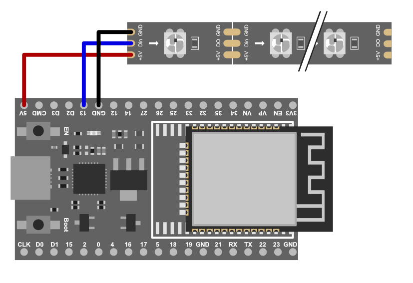

# LightDraw :black_nib: :wavy_dash:

Interactively draw pattern on decoration objects which are lit up using LED strips (e.g., WS2812B).
It could be used for example for season related objects like Easter eggs, Christmas trees, ...


## Features

- Mouse and Touch support (draw, zoom, move)
- Different pen sizes
- Predefined color palette
- Responsive design
- Runs completely on an ESP32 board

## Usage

1. Compile and flash your ESP32 board using [PlatformIO](http://platformio.org)
2. Connect the LED strip (use pin 12 as data line for the LED strip or adjust the DATA_PIN define in main.cpp)
3. Power up the EPS32 board
4. It will create a Wi-Fi "LightDraw_xxxxx" (where xxxxx is a board dependent identifier)
5. Connect to the Wi-Fi using password "light_draw"
6. Open the web browser and visit http://192.168.100.1
7. Select your home Wi-Fi and enter the password
8. The board will connect to your home Wi-Fi and will get a new IP address.
9. Connect to the web interface http://xxx.xxx.xxx.xxx (you can get the new IP most likely from your routers web interface)

## Wiring



## Customize Model

The project is not yet optimized to easily customize the model, but if you are willing to adapt a JavaScript class you can proceed as follows:

The model is defined in a JavaScript class `LEDModel` which is located in the file _html\interface.html_.
It provides three methods:

- `getDimensions()`
- `getLEDs()`
- `drawModel(context)`

### Define Figure

The object is drawn to a HTML5 canvas element using JavaScript. Drawing is implemented in the `drawModel(context)` method, which gets a drawing context ([CanvasRenderingContext2D](https://developer.mozilla.org/en-US/docs/Web/API/CanvasRenderingContext2D)).
You can find the basics on how to draw 2D elements in the following tutorial: [Mozilla Developer Network Canvas Tutorial](https://developer.mozilla.org/en-US/docs/Web/API/Canvas_API/Tutorial).

`getDimensions()` shall return the height and width of the bounding box for the drawing, e.g. `return { height: 500, width: 300 };`

### Define LEDs

The LEDs are defined on top of the drawing by specifying their ID (starting with 0) and the coordinates on the canvas.
`getLEDs()` has to return an array of all LEDs with id, (x,y) coordinates and initial color as hex value (should be #000000), e.g.

```javascript
 return [
     {x: 150, y: 70, id:0, color: '#000000'},
     {x: 173, y: 75, id:25, color: '#000000'},
     {x: 208, y: 93, id:24, color: '#000000'},
     [...]
     ];
```

## Contributions and Development

The project uses [PlatformIO](http://platformio.org) an open-source ecosystem for IoT development.
If you'd like to contribute, please fork the repository and use a feature branch. Pull requests are warmly welcome.

## License

[MIT](https://choosealicense.com/licenses/mit/)
